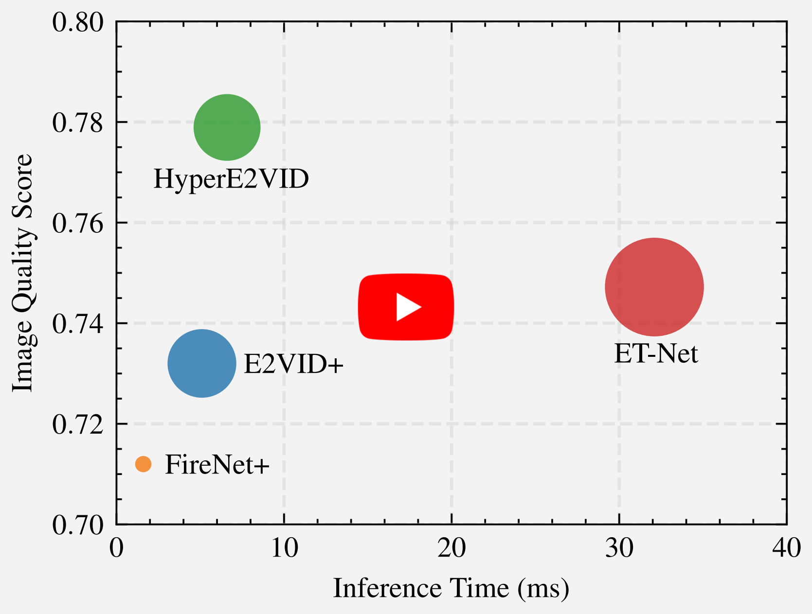

# HyperE2VID: Improving Event-Based Video Reconstruction via Hypernetworks

[](https://ercanburak-evreal.hf.space/)
[](https://arxiv.org/abs/2305.06382/)

This is the official repository of our paper titled **[HyperE2VID: Improving Event-Based Video Reconstruction via Hypernetworks](https://arxiv.org/abs/2305.06382)** by [Burak Ercan](https://ercanburak.github.io/), [Onur Eker](https://github.com/ekeronur/), [Canberk Sağlam](https://github.com/CanberkSaglam/), [Aykut Erdem](https://aykuterdem.github.io/), and [Erkut Erdem](https://web.cs.hacettepe.edu.tr/~erkut/).

<div align="center">
  <a href="https://www.youtube.com/watch?v=BWEV56-E0mE"></a>
</div

In this work we present **HyperE2VID, a dynamic neural network architecture for event-based video reconstruction**. Our approach extends existing static architectures by using **hypernetworks** and **dynamic convolutions** to generate **per-pixel adaptive filters** guided by a **context fusion** module that combines information from event voxel grids and previously reconstructed intensity images. We show that this dynamic architecture can generate **higher-quality videos** than previous state-of-the-art, **while also reducing memory consumption and inference time**.


- For more details please see our [paper](https://arxiv.org/abs/2305.06382). 
- For qualitative results please see our [project website](https://ercanburak.github.io/HyperE2VID.html).
- For more results and experimental analyses of HyperE2VID, please see the [interactive result analysis tool of EVREAL](https://ercanburak-evreal.hf.space/).
- Model codes are published under the [model folder in this repository](model).
- The pretrained model of HyperE2VID can be found [here](https://drive.google.com/drive/folders/1UuGnKwSz5C9di-cVH1QzSFjgTRNqpYep).
- For evaluation and analysis of HyperE2VID model, please use the codes in [EVREAL repository](https://github.com/ercanburak/EVREAL).
- Training codes will be published soon.

## Citations

If you use code in this repo in an academic context, please cite the following:

```
@article{ercan2023hypere2vid,
title={{HyperE2VID}}: Improving Event-Based Video Reconstruction via Hypernetworks},
author={Ercan, Burak and Eker, Onur and Saglam, Canberk and Erdem, Aykut and Erdem, Erkut},
journal={arXiv preprint arXiv:2305.06382},
year={2023}
```

## Acknowledgements

- This work was supported in part by KUIS AI Center Research Award, TUBITAK-1001 Program Award No. 121E454, and BAGEP 2021 Award of the Science Academy to A. Erdem.
- This code borrows from or is inspired by the following open-source repositories:
  - https://github.com/uzh-rpg/rpg_e2vid
  - https://github.com/TimoStoff/event_cnn_minimal
  - https://github.com/ZeWang95/ACDA
